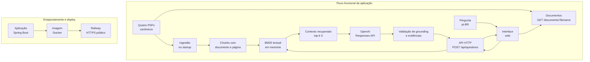
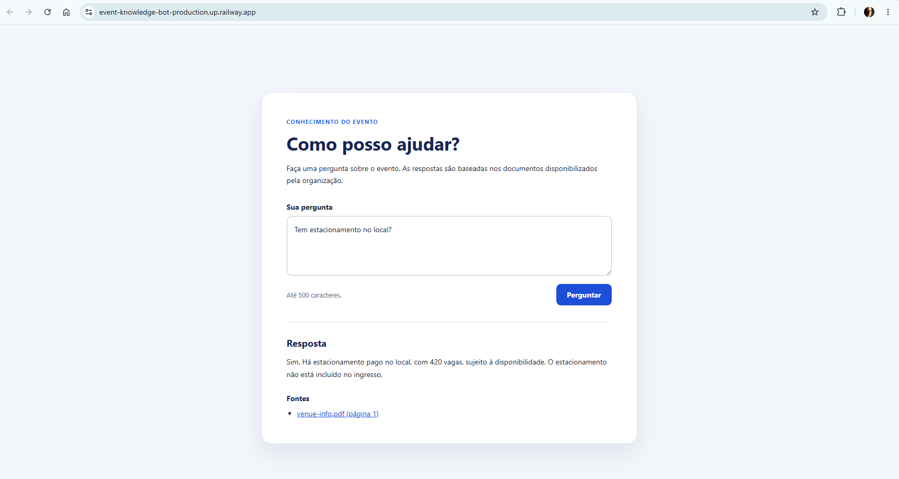
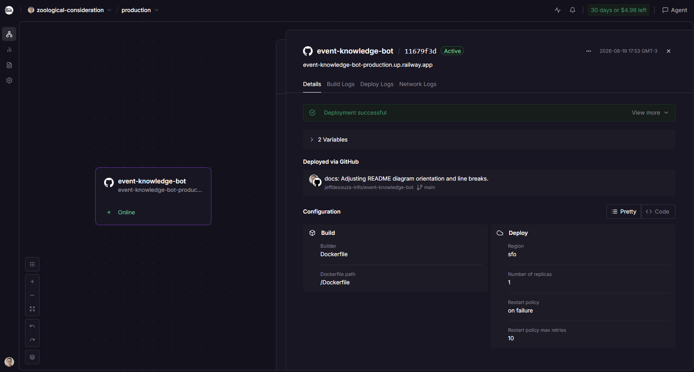
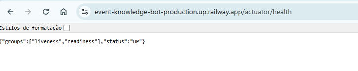
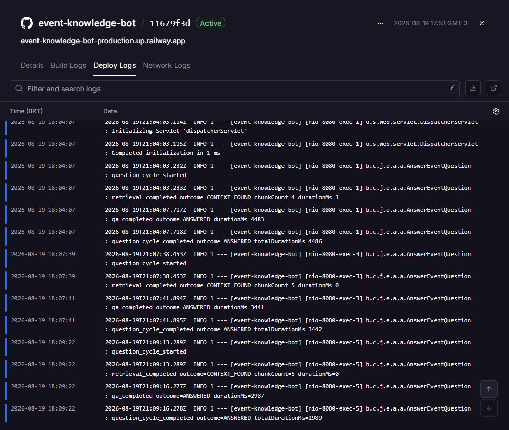

# Event Knowledge Bot

O Event Knowledge Bot responde perguntas em português brasileiro sobre um evento usando somente informações sustentadas pelo corpus documental fornecido. Ele permite consultar PDFs por linguagem natural, mantendo a resposta ligada às evidências recuperadas e informando quando os documentos não são suficientes.

## Arquitetura e fluxo

A aplicação é um monólito Spring Boot, com limites simples entre ingestão/retrieval, caso de uso de perguntas, adaptador OpenAI e entrega HTTP. Não há banco de dados, embeddings, vector store, fila ou serviço de busca externo.



No startup, `ClasspathPdfDocumentAdapter` localiza exclusivamente `classpath*:/documents/pdfs/*.pdf`; o PDFBox extrai texto página a página; `KnowledgeChunker` produz chunks com sobreposição; e o snapshot BM25 é publicado em memória. O retrieval usa análise lexical determinística em português (lowercase, remoção de diacríticos, tokenização Unicode e stopwords) e top-k igual a 5.

O contexto recuperado é enviado à OpenAI como dados não confiáveis, nunca como instrução. O adaptador usa a Responses API (`/v1/responses`) com Structured Outputs. A aplicação valida o status, a resposta e os `evidenceChunkIds`; fontes só são projetadas a partir de chunks realmente presentes no contexto recuperado.

## Corpus canônico

Os quatro PDFs empacotados em `src/main/resources/documents/pdfs/` são a fonte autorizada dos fatos do MVP:

- `event-guide.pdf`: guia geral, incluindo credenciamento às 07:30 nos dois dias e horários gerais do evento.
- `event-program.pdf`: programação e horários das sessões, incluindo “RAG na Prática”.
- `faq.pdf`: perguntas frequentes sobre entrada após o início de uma sessão, inscrições, credenciais, malas e gravações.
- `venue-info.pdf`: informações do local, entradas, Wi-Fi, estacionamento e acessibilidade.

O startup atual ingere os quatro documentos e produz 33 chunks. `ticket.pdf` não faz parte do corpus canônico.

## Execução local

Requisitos: Java 21, Windows/PowerShell (ou ambiente equivalente para o Maven Wrapper) e uma chave OpenAI para executar o fluxo real. Docker é opcional para reproduzir a imagem publicada.

Configure os valores externamente, sem versionar `.env` ou chaves:

```powershell
$env:OPENAI_API_KEY = "<sua-chave-openai>"
$env:OPENAI_MODEL = "<modelo-openai-suportado>"
./mvnw.cmd spring-boot:run
```

`OPENAI_API_KEY` é a credencial usada pelo adaptador da Responses API. `OPENAI_MODEL` identifica o modelo que deve gerar a resposta estruturada; informe um modelo disponível para sua conta e compatível com a API. A aplicação não fornece credenciais padrão.

`PORT` é aceita externamente pela aplicação. Sem essa variável, o servidor usa `8080` como fallback local.

```powershell
./mvnw.cmd test
./mvnw.cmd package
java -jar target/event-knowledge-bot-0.0.1-SNAPSHOT.jar
```

Abra `http://localhost:8080/` após o startup. A suíte padrão não chama a OpenAI: ela usa testes determinísticos e valida ingestão, retrieval, grounding, HTTP, UI e a superfície operacional. O teste opt-in contra o provedor real é separado e exige credencial externa:

```powershell
./mvnw.cmd -Popenai-smoke test
```

## API e comportamento

### `POST /api/questions`

Recebe uma pergunta com até 500 caracteres:

```json
{"question":"Que horas começa o credenciamento?"}
```

Uma resposta contém `answer` e `sources`, com nome do PDF, página e URL pública do documento. Entradas ausentes, vazias ou acima do limite retornam `400` em pt-BR. Falha do provedor retorna `503` sem detalhes internos.

Exemplo respondível, compatível com o corpus e com o fluxo integrado:

```text
Pergunta: Que horas começa o credenciamento?
Resposta: O credenciamento começa às 07:30.
Fonte: event-guide.pdf, página 1 — /documents/event-guide.pdf
```

Outros exemplos obtidos do deployment público:

```text
Pergunta: Qual é o horário do evento na quinta-feira?
Resposta: Na quinta-feira, o evento acontece das 08:00 às 19:00.
Fonte: event-guide.pdf, página 1 — /documents/event-guide.pdf
```

```text
Pergunta: Quando acontece RAG na Prática?
Resposta: A sessão “Retrieval-Augmented Generation na Prática” acontece das 11:25 às 12:15, na sala Aurora. A data não está informada nos trechos disponíveis.
Fonte: event-program.pdf, página 1 — /documents/event-program.pdf
```

```text
Pergunta: Participantes Premium precisam de inscrição adicional nos workshops?
Resposta: Não. Participantes Premium podem acessar os workshops práticos sem inscrição adicional, mas a entrada está sujeita à capacidade da sala.
Fontes: event-guide.pdf, página 1; event-program.pdf, página 2; faq.pdf, página 1
```

```text
Pergunta: Qual é o nome da rede Wi-Fi?
Resposta: FutureTech-Guest
Fontes: venue-info.pdf, página 1; faq.pdf, página 1
```

```text
Pergunta: O local possui acesso para pessoas com mobilidade reduzida?
Resposta: Sim. O local possui acesso sem degraus pelos Portões A e B, elevadores para todos os andares e banheiros acessíveis próximos às salas Aurora, Atlas e Orion. Quem precisar de assistência pode solicitá-la no Credenciamento ou no balcão de informações.
Fonte: venue-info.pdf, página 1 — /documents/venue-info.pdf
```

Exemplo sem informação suficiente:

```text
Pergunta: O evento terá transmissão ao vivo?
Resposta: Não encontrei essa informação nos documentos disponíveis sobre o evento.
Fontes: []
```

O FAQ mencionar gravações não é evidência de transmissão ao vivo. Quando a informação necessária não é sustentada pelo contexto, o resultado interno é `INSUFFICIENT_INFORMATION`, a API retorna a mensagem fixa em pt-BR e `sources: []`.

### `GET /documents/{filename}`

Abre somente os quatro PDFs presentes no catálogo carregado. `/documents/event-guide.pdf` retorna um PDF com `application/pdf`; nomes desconhecidos, tentativas de traversal e arquivos fora do catálogo retornam `404`.

### `GET /actuator/health`

Expõe o health check mínimo, sem detalhes internos. Em execução saudável, retorna HTTP `200` com status `UP`.

A interface web em `/` é HTML, CSS e JavaScript puro, na mesma origem da API. Permite enviar perguntas, exibe carregamento e erros em pt-BR e apresenta fontes como links clicáveis para abertura dos PDFs. Dados da API são renderizados com `textContent` e criação de elementos DOM.

## Docker

O `Dockerfile` usa Maven com Java 21 para compilar o JAR e uma imagem final `eclipse-temurin:21-jre`. Os PDFs entram no JAR durante o build; segredos, `.env`, `specs` e artefatos locais ficam fora do contexto por `.dockerignore`.

```powershell
docker build -t event-knowledge-bot:local .
docker run --rm -p 8080:8080 -e OPENAI_API_KEY="<sua-chave-openai>" -e OPENAI_MODEL="<modelo-openai-suportado>" event-knowledge-bot:local
```

O container respeita `PORT` quando fornecida pelo ambiente; localmente, `8080` continua sendo o fallback.

## Deployment no Railway

O MVP publicado usa o repositório conectado ao Railway e o `Dockerfile` do projeto para o build. A aplicação roda em um único serviço Railway, com `OPENAI_API_KEY` e `OPENAI_MODEL` configuradas como Service Variables externas. O Railway fornece `PORT`; a configuração local mantém `8080` como fallback.

O serviço usa Public Networking e HTTPS público gerenciado pela Railway. URL pública atual:

<https://event-knowledge-bot-production.up.railway.app>

Health check: <https://event-knowledge-bot-production.up.railway.app/actuator/health>

Interface: <https://event-knowledge-bot-production.up.railway.app/>

Uma avaliação completa deve conferir health check, interface, pergunta respondível, fonte exibida e abertura do PDF. A chave não é documentada nem armazenada no repositório.

## Segurança e limites

- Não há credenciais, tokens ou senhas no código ou na documentação.
- Arquivos `.env` contendo configuração local ou segredos são ignorados pelo Git;
  `.env.example` é versionado e contém somente placeholders.
- O acesso a documentos é por allowlist do catálogo, sem leitura arbitrária de caminhos.
- Conteúdo recuperado é dado não confiável e não pode redefinir as instruções do assistente.
- Respostas sem evidência não são apresentadas como fatos do evento.

## Demonstração

### Resposta grounded com fonte

A aplicação responde usando o conteúdo recuperado dos documentos e apresenta
a fonte utilizada como evidência.



### Deployment público

O MVP está publicado no Railway e acessível por HTTPS.



### Heatlh check

Health check responde que a API está em funcionamento.



<details>
  <summary><strong>Logs de execução</strong></summary>

  <p>
    Exemplo de logs diagnósticos do pipeline de retrieval e question answering
    após o deploy do MVP.
  </p>

  

</details>

## Tecnologias

Java 21, Spring Boot 4.0.7, Spring MVC, Spring Validation, Spring Actuator, Spring RestClient, Apache PDFBox 3.0.5, BM25 textual em memória, HTML/CSS/JavaScript sem framework, Maven Wrapper, Docker e Railway.
